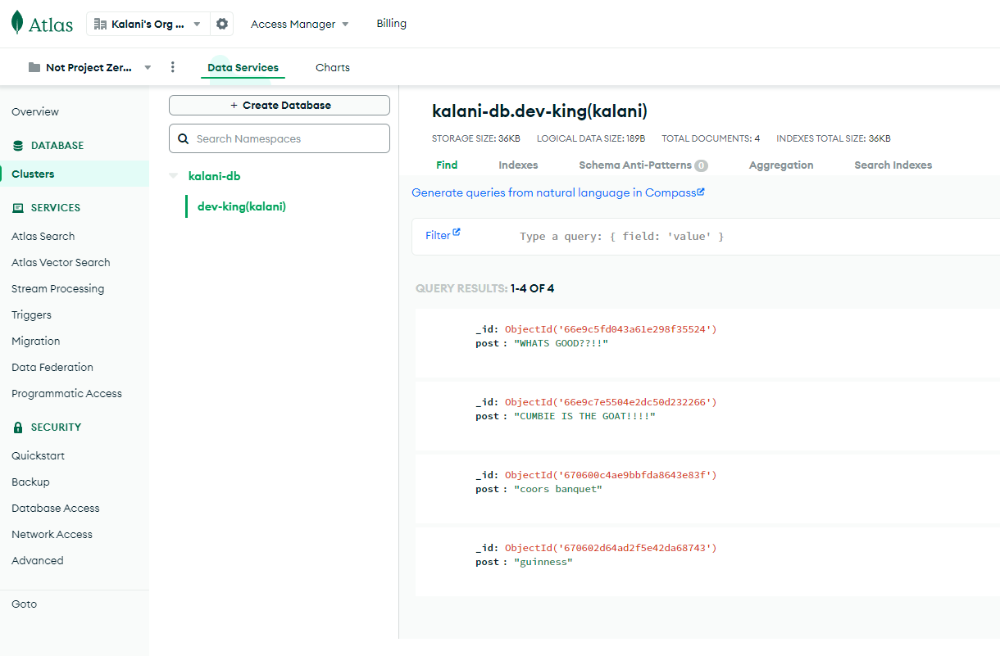

# dev-ida-lab-sorensen
This web app is called "Snack Attack Pack", it is used to create a grocery list and that list is then posted in a MongoDB database collection. Users are able to view, update, and delete their list through the web appilcation.

### Issues
- [Issue #30](https://github.com/babayaga1013/dev-ida-lab-sorensen/issues/30)
### Pull Requests
- [Pull Request #31](https://github.com/babayaga1013/dev-ida-lab-sorensen/pull/31)
### Languages, Packages, Frontend/Backend, Devops
  

### Web Application

### MongoDB

